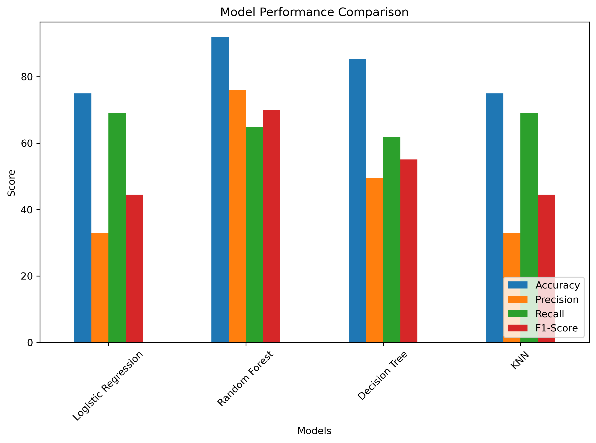
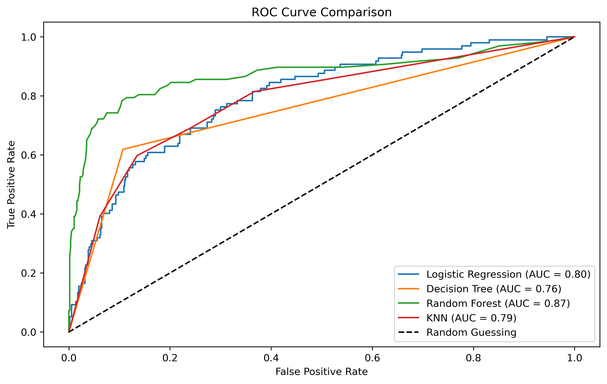
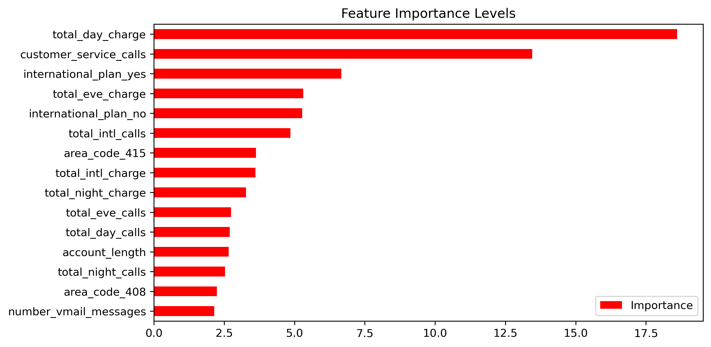

# THE SYRIATEL CUSTOMER CHURN ANALYSIS
## Overview of the project
Customer churn is a critical issue for businesses, especially in highly competitive industries like telecommunications. Churn occurs when customers stop using a company’s services and switch to competitors. Retaining customers is often more cost-effective than acquiring new ones, which makes churn prediction an important task.

In response to this challenge, telecom companies are exploring churn prediction mechanisms, which will proactively address customer concerns, improve service delivery, and implement targeted retention strategies.  This project aims to develop a predictive model that will identify customers at risk of churning, helping SyriaTel Telecommunications company minimize churn and reduce losses.

## Business and Data Understanding 

**Business problem**

Syriatel is struggling with rising customer churn, which threatens its revenue and market position. The company lacks a clear way to know customers that are likely to leave. Without timely insights, Syriatel risks losing more customers to competitors and incurring higher costs to replace them. Developing a predictive solution is critical to identify at risk customers early and take proactive steps to retain them. This will provide insights to the Company to know the factors that drive churn. 

**Data Understanding**

This project utilizes a publicly available [Syriatel Telecom Customer Churn Dataset](https://www.kaggle.com/datasets/becksddf/churn-in-telecoms-dataset) from Kaggle containing information about Syriatel's customers. The dataset contains 3333 customer records and 21 features therefore, it is ideal for this task because it contains a demographic, account, and service usage information that is typical in the telecom industry and highly relevant for predicting churn.

The key features for the dataset were:

1. `State` and `Area code`: It contains the different states and area codes of the customers subscribed to SyriaTel company.

2. `International plans` and `Voice Mail Plans`: Shows customers subscribed to either an International plan or voice mail plan.

3. `Call rates`: It gives information on the different call rates for the customers for day, night, evening, and international calls.

4. `Customer Service calls`: It provides information on the number of customer service calls.

## Data Preparation
This stage involved preparing the dataset to ensure accuracy, consistency and readiness for modeling.

**Data Cleaning**
Steps followed:

 - Dropping Irrelevant Features: The phone number column was dropped as it is a unique identifier and does not add predictive value

 - Validation of Categorical Columns: Categorical features  were checked for valid entries.

 - Standardizing Values: Converted text columns to lowercase and stripped spaces.

 - Standardizing Column Names: All column names were converted to lowercase with underscores for consistency and ease of use in code.

 - Handling Missing Values: No missing values were detected in the dataset.

 - Duplicate Records: No duplicate rows were found.

 - Data Type Validation: Categorical columns were explicitly converted to category type. Numerical columns were validated as numeric.

 - Target variable churn was confirmed as boolean.

**Exploratory Data Analysis (EDA)**

EDA provided insights into feature distributions and their relationships with churn. We mainly focused on:

 - Univariate Analysis

 - Bivariate Analysis

 - Multivariate Analysis

**Data Preprocessing**
 - Splitting Features and Target

 - Train-Test Split

 - One-Hot Encoding

 - Scaling Numerical Features

 - Combining Processed Features

 - Handling Class Imbalance

## Modeling approach
The problem is framed as a supervised binary classification task. Our steps were:

1. Implementing the train_test_split method to split the dataset into training and testing sets.

2. Resampling the data to handle class imbalance in the target variable.

3. Training four different types of models with Logistic Regression as the baseline model.

4. Predictions were evaluated against the true test values (y_test) using a comprehensive set of metrics.

5. Plotting the confusion matrix to evaluate the rate of true and false positives and negatives for each model.

## Evaluation
Assessed how well our models performed to determine if they met the main business objective of predicting and reducing customer churn.

**Model Comparison – Key Metrics**

We compared the models using accuracy, precision, recall, and F1-score.

 - Random Forest achieved the highest performance making it the most reliable model for churn prediction.

 - Decision Tree performed moderately with balanced recall and accuracy.

 - Logistic Regression and KNN achieved similar results but struggled with precision, making them less suitable for deployment.

**Model Comparison – ROC Curves**

The ROC curves and AUC scores further highlighted Random Forest as the best-performing model. Its curve stayed closest to the top-left corner of the plot, indicating strong discriminatory power between churners and non-churners.

**Hyperparameter Tuning – Random Forest**

We optimized the Random Forest model using GridSearchCV with cross-validation. After tuning the model achieved 91% accuracy on the test set.It correctly identified 71% of churners (recall) while maintaining 69% precision, balancing the trade-off between false positives and false negatives.

Feature importance analysis revealed that customer service calls, international plans, and day-time charges were the strongest predictors of churn.

## Key Visualizations
1. The model metrics comparison (Bar Chart) - 
This bar chart displays the model comparison of our classification models.

2. The ROC curve - 
This plot displays the different ROC curve of our models.
  

3. Feature Importances (Bar Chart) - 
This bar chart displays the features that most impact churn.

## Conclusion
The analysis of the Syriatel customer churn dataset provided valuable insights into the factors that drive customer churn. Through exploratory analysis and predictive modeling, we identified customer service calls, international plans, and day time charges as the strongest indicators of churn.

Among the models tested, the Random Forest Classifier consistently outperformed others, achieving 91% accuracy and correctly identifying 71% of churners after hyperparameter tuning. This balance between accuracy and recall makes it a practical tool for churn prediction in real world scenarios.

**Recommendations:**

1. Enhance customer support services to reduce complaints and frustrations.

2. Reassess pricing strategies for international and high usage plans.

3. Implement targeted retention campaigns focused on customers flagged as high risk by the churn model.

4. Continuously monitor churn metrics and update the predictive model with new customer data to maintain accuracy.

## Repository Structure
 - `Images` folder    -   Visuals 
 - `Data` folder     -   datasets
 - `README.md`      -    Project overview and navigatio
 - `SyriaTel_Customer_Churn_Data_Report` - Data report
 - `Syriatel_group_presentation pdf` -   Project presentation 
 - `customer_churn.ipynb`  -   Jupyter notebook for data cleaning and analysis

 ## Technologies Used
- Python (`pandas`, `matplotlib`, `seaborn`, `Scikit Learn`)
- Jupyter notebook
- Git & GitHub

## Authors
1. [Vincent Toroitich](https://github.com/Limo-Vincent)
2. [Marion Mengich](https://github.com/Marionmengich)
3. [Nicole Kagendo](https://github.com/nicole58-prog)
4. [Dennis Chesire](https://github.com/dennischesire)
5. [Morgan Amwai](https://github.com/morgyy)
6. [Franklin Kuira](https://github.com/franklinkuira)

 
